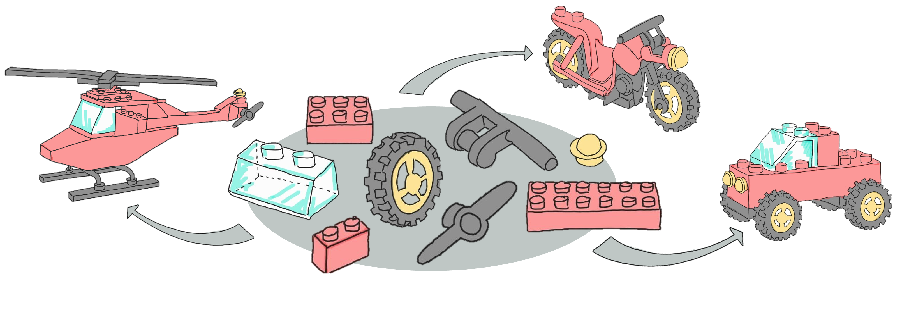

# Dynamic Visualization for Clinical Insights (DaVinci)

### ABSTRACT
DaVinci is a dynamic, modular framework designed for interactive data exploration and visualization in clinical 
research. It is particularly intended to support exploratory biomarker analysis and safety review during study conduct. 
The framework's modules function as building blocks that can be combined to create customized R/Shiny 
applications, tailored to specific clinical trial and research project needs. DaVinci offers a variety of functionalities, 
including the ability to plot, for example, heatmaps, waterfall, and eDISH plots, as well as generate tables and listings. 
Currently, it boasts twelve output modules, with ongoing development to expand its capabilities. In a move towards 
community-driven growth and refinement, DaVinci has been open-sourced recently. 

### INTRODUCTION
Successful conduct of clinical trials heavily relies on regular data reviews, in order to ensure patient safety, monitor 
data flow and recruitment, guarantee protocol compliance, assess data quality, etc. Moreover, regular data reviews 
are also meant to provide an opportunity for exploratory parameter analysis allowing for the identification of trends, 
patterns, and relationships within the data that may not be immediately apparent.
Compared to extensive static outputs like tables, listings, and figures in PDF format, such data review procedures can 
be greatly enhanced by utilizing interactive visualization tools. This is where R/Shiny applications have proven 
excellent means for reviewers to dive deep into the study data through dynamic plots, along with real-time data 
access.  

### THE MODULAR APPROACH
In a naive approach of using R/Shiny for interactive data visualization, one can create a comprehensive stand-alone 
application, that satisfies the needs of as many studies as possible. It has been observed, however, that these stand alone apps quickly become unwieldy and miss user expectations. Moreover, some minor trial-specific adjustments 
are impossible to be implemented without disrupting functionality for other trials. Therefore, instead of creating 
universal stand-alone apps, DaVinci intends to provide individual modules. R/Shiny modules serve as functional 
building blocks that can be easily linked together into customized apps. This customization enables trial teams to 
quickly build trial-specific but lean apps without extensive programming knowledge. The concept of developing 
loosely coupled, functional units and composing them into a larger application is referred to as modular approach

{fig-align="center"}

The figure above schematically demonstrates the modular approach by means of building blocks. In this analogy, the building 
blocks symbolize the different modules. Depending on the use case, one might choose and assemble the building blocks
to build a helicopter, a motorcycle, or a pick-up truck. Similarly, the trial team will develop their trial-specific 
application by choosing and assembling the modules based on the team’s unique requirements.

### CONCLUSION
In conclusion, DaVinci provides a dynamic, modular framework for interactive data exploration and visualization in the 
field of clinical research. Its modular design allows for the creation of lean, trial-specific applications, making this 
framework flexible and versatile. One of DaVinci's key features is its drill-down functionality, which is especially useful 
for data exploration and review during study conduct. It also integrates with modules from other modular open-source 
frameworks like Teal, further diversifying its range of functionalities. By making DaVinci open-source on GitHub, it 
opens the door for improvements and growth from the community.

#### More information can be found on the [DaVinci website](https://boehringer-ingelheim.github.io/davinci/)
